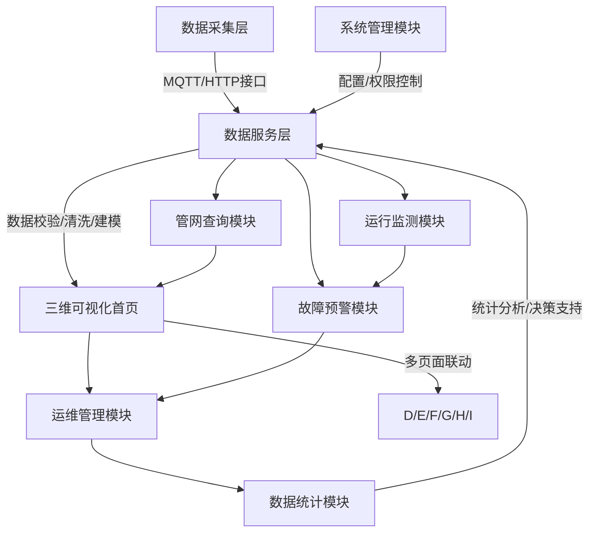

# 热力管网可视化大屏 - 系统功能文档

## 1. 系统概述

基于 Vue3 + TypeScript + Vite + Cesium 技术栈开发的三维热力管网可视化大屏项目，用于实时监控和管理热力管网系统的运行状态。

### 1.1 核心目标
- 实现热力管网系统的实时可视化监控
- 提供直观的热力数据展示和分析功能
- 支持设备状态监测和异常预警
- 实现历史数据趋势分析和对比
- 提供响应式设计，适配不同尺寸的大屏显示
- 涉及用户权限管理系统

### 1.2 技术栈
- **前端框架**：Vue 3 + TypeScript + Vite
- **三维可视化**：Cesium
- **图表库**：ECharts
- **状态管理**：Pinia
- **UI组件**：Element Plus
- **网络请求**：Axios
- **实时数据**：WebSocket

## 2. 系统架构

系统采用“一屏统揽、多页联动”的架构，以三维可视化首页为核心，联动7大功能模块，形成“数据采集—数据处理—可视化展示—业务应用—决策支撑”的完整业务闭环。

### 2.1 核心业务流程

## 3. 功能模块

### 3.1 登录与权限管理

#### 3.1.1 展示信息
- 登录页面：系统名称、登录表单（用户名、密码、验证码）、忘记密码入口、注册入口（仅超级管理员可见）、系统版本号、技术支持联系方式、安全提示。
- 个人中心：当前登录用户信息（用户名、角色、联系方式）、密码修改入口、账号切换、退出登录。
- 权限管理页面：用户列表（用户ID、用户名、角色、状态、创建时间）、角色列表（角色ID、角色名称、权限范围）、权限配置界面。

#### 3.1.2 功能按钮
- 登录相关：登录、验证码刷新、忘记密码、注册（仅超级管理员）、退出登录。
- 用户管理：新增用户、编辑用户、删除用户、重置密码、批量启用/禁用用户。
- 角色管理：新增角色、编辑角色、删除角色、权限配置、批量操作。

#### 3.1.3 业务逻辑
- 登录校验：用户名、密码、验证码三重校验，错误提示不明确枚举；连续5次登录失败，账号锁定15分钟。
- 记住密码：基于JWT Token实现，Token有效期7天，加密存储于localStorage。
- 单点登录（SSO）：同一账号在不同设备登录，后者会强制前者登出。
- 密码管理：忘记密码需验证手机号/邮箱，新密码需满足“8-16位，包含字母、数字、特殊字符”的规则。
- 权限控制：采用RBAC（基于角色的访问控制）模型，权限细化至按钮级。

### 3.2 三维可视化首页

#### 3.2.1 展示信息
- 顶部状态栏：当前登录用户、登录时间、系统运行状态、实时在线人数、数据更新时间、消息通知。
- 左侧导航栏：所有功能模块入口，支持折叠/展开。
- 中间三维场景区：基础地理信息、热力管网模型、实时状态标注、辅助信息。
- 右侧工具栏：视图操作工具、图层控制、剖切分析、测量工具、定位工具、视角切换、截图/录屏等。
- 底部信息栏：实时告警数量、今日运维任务数量、未处理故障数量。

#### 3.2.2 功能按钮
- 顶部操作：刷新数据、全屏展示、数据同步、个人中心、帮助中心、消息通知。
- 视图操作：放大、缩小、平移、旋转、复位、漫游。
- 图层控制：图层列表展开/收起、单个图层显示/隐藏、透明度调节、按类型筛选图层、图例显示/隐藏。
- 分析工具：剖切分析、距离测量、面积测量、高度测量。
- 定位工具：输入管网ID/设备名称/坐标定位、收藏点位快速定位、历史定位记录查看。
- 视角切换：预设视角、自定义视角保存/加载。
- 其他操作：截图、录屏、场景导出。

#### 3.2.3 业务逻辑
- 场景加载优化：默认加载城市低精度底图 + 管网高精度模型，实现渐进式加载。
- 性能优化：采用视锥体裁剪、LOD细节层次调度、Web Workers后台处理。
- 离线加载：网络断开时，加载本地缓存的三维模型与最近1小时数据。
- 相机控制：点击定位、视角切换时，相机采用飞行动画，平滑过渡。
- 拾取与查询：左键点击拾取管网/设备，弹出详细信息弹窗。
- 数据同步：默认每3秒同步一次核心监测数据，30秒同步一次一般状态数据。

### 3.3 管网查询模块

#### 3.3.1 展示信息
- 查询条件区域：基础条件、扩展条件、状态条件、高级条件。
- 查询结果区域：表格形式展示查询结果，包含ID、名称、类型、规格、材质、建设年代、所在区域、运行状态、实时监测数据、负责人、维护周期等信息。
- 关联展示区：右侧显示查询结果对应的三维缩略图，点击表格中某条数据，左侧三维场景自动定位至对应管网/设备并高亮标注。
- 统计信息：页面顶部显示查询结果总数、正常运行数量、异常数量、待维护数量。

#### 3.3.2 功能按钮
- 查询操作：查询、重置、高级查询（展开/收起）、模糊检索（实时联想）。
- 结果操作：导出（Excel格式）、刷新、定位、查看详情、打印详情。
- 筛选操作：按运行状态、材质、管径、压力等级等维度快速筛选，支持多维度组合筛选；表格排序。

#### 3.3.3 业务逻辑
- 查询机制：输入/选择查询条件后，点击“查询”触发请求，系统从数据库筛选符合条件的数据。
- 结果联动：选中表格中某条数据，表格行高亮，同时三维场景自动定位至对应管网/设备。
- 导出功能：支持导出全部查询结果或选中数据，Excel文件包含表格中所有字段。
- 查询记录：系统自动留存最近10条查询条件，用户可点击快速加载历史查询条件。

### 3.4 运行监测模块

#### 3.4.1 展示信息
- 监测总览：页面顶部显示核心监测指标（全网平均温度、平均压力、平均流量、异常点位数量）。
- 实时监测列表：表格形式展示所有监测点位信息，包含点位ID、所属管网、监测类型、实时数值、单位、正常范围、当前状态、数据更新时间、所属区域。
- 趋势分析图表：核心区域展示监测数据趋势图，可选择单个/多个监测点位、监测指标，设置时间范围。
- 异常监测区：单独展示异常监测点位，标注异常类型、异常数值、异常持续时间。
- 监测点位分布：右侧显示监测点位三维缩略图，标注点位位置与状态。

#### 3.4.2 功能按钮
- 数据操作：刷新数据、筛选（按监测类型、区域、运行状态）、数据导出（Excel格式）、历史数据查询。
- 趋势分析：图表切换（折线图/柱状图）、时间范围选择、点位多选对比、图表下载（图片格式）。
- 预警设置：阈值设置（管理员）、告警方式配置（弹窗/声音/短信）、告警接收人员选择。
- 其他操作：定位点位、查看点位详情、异常处置（快速创建告警工单）。

#### 3.4.3 业务逻辑
- 数据刷新机制：核心监测点每3秒更新一次，一般状态点每30秒更新一次；实时数据采用WebSocket推送。
- 异常判断：实时数据与预设阈值对比，超出正常范围则标记为异常，触发告警。
- 趋势分析：选择监测点位、指标与时间范围后，系统自动从时序数据库调取历史数据，生成趋势图。
- 阈值设置：管理员可设置各监测指标的正常范围，支持批量设置同类型监测点位的阈值。
- 历史数据查询：输入时间范围、监测点位，可查询历史监测数据，支持导出、打印。

### 3.5 故障预警模块

#### 3.5.1 展示信息
- 告警总览：页面顶部显示告警总数，按故障等级（Ⅰ级紧急/红色、Ⅱ级一般/橙色、Ⅲ级提示/黄色）分类统计。
- 故障预警列表：表格形式展示所有告警信息，包含告警ID、故障类型、故障点位、所属管网、故障等级、故障描述、发生时间、处理状态、处理人员、处理进度。
- 故障详情区：选中某条告警，右侧显示故障详情，同时显示三维场景缩略图，标注故障位置及周边管网分布。
- 故障地图：底部显示故障点位地理分布地图，按故障等级用不同颜色标注。
- 处理记录：展示每条告警的处理过程，形成故障处置档案。

#### 3.5.2 功能按钮
- 告警操作：刷新告警、筛选（按故障等级、类型、处理状态、发生时间）、定位故障、分配处理、删除告警（仅已处理/已驳回）、导出告警列表。
- 处理操作：接单、处理反馈、提交验收、驳回处理、上传现场照片/视频。
- 其他操作：查看应急预案、故障分析、历史告警查询。

#### 3.5.3 业务逻辑
- 告警分级与触发：
  - Ⅰ级（紧急/红色）：爆管、大面积泄漏、超温超压严重，需立即处理。
  - Ⅱ级（一般/橙色）：局部波动、阀门故障、轻微泄漏。
  - Ⅲ级（提示/黄色）：数据异常波动，需关注。
- 故障处置流程：
  1. 系统自动生成告警工单，标记为“未处理”。
  2. 调度指挥或超级管理员分配给对应运维工程师，工单状态更新为“待执行”。
  3. 运维工程师接单，工单状态更新为“处理中”。
  4. 处理完成后，运维工程师提交验收申请，工单状态更新为“待验收”。
  5. 调度指挥或超级管理员确认验收通过则工单状态更新为“已处理”，驳回则更新为“未处理”。

### 3.6 运维管理模块

#### 3.6.1 展示信息
- 任务筛选区域：按任务状态、运维类型、分配人员、执行周期、责任区域筛选任务。
- 运维任务列表：表格形式展示所有运维任务，包含任务ID、任务名称、运维类型、涉及管网/设备、分配人员、执行期限、当前状态、创建时间、完成进度、负责人。
- 任务详情区：选中某条任务，右侧显示任务详情；执行中的任务显示实时执行进度、运维人员位置轨迹。
- 运维统计：页面顶部显示今日/本周/本月运维任务总数、待执行任务数、已完成任务数、逾期任务数。
- 运维历史记录：展示所有已完成/已驳回的运维任务，支持按时间、人员、类型检索。

#### 3.6.2 功能按钮
- 任务管理：创建任务、分配任务、编辑任务、删除任务、批量操作（批量分配、批量删除）。
- 任务执行：接单、执行任务、暂停任务、提交验收、上传进度/照片/视频、查看轨迹。
- 验收管理：验收任务、驳回任务、填写验收意见。
- 其他操作：导出任务列表、历史记录查询、巡检路线规划、离线任务下载。

#### 3.6.3 业务逻辑
- 任务状态流转：待分配 → 待执行 → 执行中 → 待验收 → 已完成/已驳回。
- 离线运维与巡检打卡：运维人员可下载巡检任务包，无网络环境下依然可执行运维任务；到达巡检点位后，通过GPS/定位打卡。
- 任务创建与分配：创建任务时，需选择运维类型、涉及管网/设备、执行期限、分配人员、运维要求。
- 验收管理：验收时，管理员需查看运维人员提交的处理措施、现场照片/视频，对照验收标准进行审核。

### 3.7 数据统计模块

#### 3.7.1 展示信息
- 统计总览：页面顶部显示核心统计指标（管网总长度、设备总数、运维任务完成率、故障处置率、平均故障处置时间、全网能耗数据、热负荷预测值）。
- 可视化图表区：管网分布统计、运行数据统计、运维统计、故障统计、能耗统计。
- 报表展示区：显示各类统计报表，支持按时间范围筛选。
- 筛选条件区：按时间范围、区域、管网类型、运维类型、故障类型筛选统计数据。

#### 3.7.2 功能按钮
- 统计操作：刷新统计、筛选（时间、区域、类型）、图表切换（饼图/柱状图/折线图/表格）、数据对比。
- 报表操作：报表导出（Excel格式）、报表打印、自定义报表生成、定时报表设置。
- 图表操作：图表下载（图片格式）、图表放大/缩小、数据详情查看。
- 其他操作：热负荷预测、历史统计数据查询、统计结论导出。

#### 3.7.3 业务逻辑
- 统计机制：系统定期（每日凌晨1点）自动采集管网运行数据、运维数据、故障数据，进行统计分析。
- 自定义报表：支持拖拽式生成报表，用户可选择数据源、统计指标、统计维度，设置报表格式。
- 定时报表：支持设置定时报表（每日/每周/每月），系统自动生成报表，通过邮件推送至指定负责人。
- 热负荷预测：基于历史运行数据、气象数据、时间维度，采用机器学习算法，预测未来3天的热负荷需求。
- 数据对比：支持选择两个不同时间段、不同区域的统计数据，进行对比分析。

### 3.8 系统管理模块

#### 3.8.1 展示信息
- 导航菜单：分为用户管理、角色管理、数据管理、系统配置、日志管理、备份恢复6个模块。
- 用户管理区：展示所有系统用户信息，包含用户ID、用户名、角色、联系方式、创建时间、账号状态、最后登录时间。
- 角色管理区：展示所有用户角色，包含角色ID、角色名称、权限范围、创建时间、关联用户数量。
- 数据管理区：显示系统数据存储状态、数据导入/导出界面、数据清理界面、数据校验界面。
- 系统配置区：展示系统基础配置、数据配置、告警配置、三维配置、接口配置。
- 日志管理区：展示系统操作日志、登录日志、故障日志、异常日志。
- 备份恢复区：显示备份记录、备份设置界面、恢复操作界面。

#### 3.8.2 功能按钮
- 用户管理：新增用户、编辑用户、删除用户、重置密码、批量启用/禁用、批量删除。
- 角色管理：新增角色、编辑角色、删除角色、权限配置、批量操作、角色复制。
- 数据管理：数据导入（支持Excel、CAD、GeoJSON等格式）、数据导出、数据清理、数据校验、数据同步（与外部系统）。
- 系统配置：基础配置修改、数据配置修改、告警配置修改、三维配置修改、接口配置修改、配置保存/重置。
- 日志管理：日志查询、日志筛选、日志导出、日志清理、日志详情查看。
- 备份恢复：手动备份、自动备份设置、备份文件查看、备份恢复、备份删除。

#### 3.8.3 业务逻辑
- 数据管理：导入前进行数据校验，检测并提示数据错误；支持批量导入；可设置清理周期，自动清理过期数据。
- 系统配置：所有配置修改后需点击“保存”生效，支持“重置”恢复默认配置。
- 日志管理：日志按类型分类存储，操作日志、登录日志保留6个月，故障日志、异常日志保留1年。
- 备份恢复：可选择全量备份或增量备份；设置自动备份周期；选择备份文件，触发系统恢复。
- 权限管控：系统管理模块所有操作均需超级管理员权限，操作记录留存至操作日志。

## 4. 页面联动逻辑

### 4.1 登录页面与其他页面
- 登录成功后，根据用户角色跳转至对应首页（超级管理员→系统管理首页，其他角色→三维可视化首页）。
- 未登录用户访问任何页面，均自动跳转至登录页面。
- 登录状态失效（如Token过期），弹出提示并跳转至登录页面。

### 4.2 三维可视化首页与其他页面
- 所有页面可通过首页左侧导航栏快速切换。
- 首页底部快捷按钮（告警详情、运维任务、数据统计）直接跳转至对应页面。
- 其他页面的“定位”按钮，均跳转至首页并定位至对应管网/设备，高亮标注。

### 4.3 运行监测页面与故障预警页面
- 运行监测数据超出阈值时，自动触发故障预警，同步更新故障预警页面数据。
- 故障预警页面可查看详细的故障信息，并跳转至运行监测页面查看历史数据趋势。

### 4.4 故障预警页面与运维管理页面
- 故障预警页面可直接创建运维任务，跳转至运维管理页面。
- 运维管理页面可查看关联的故障信息，跳转至故障预警页面。

## 5. 数据模型

### 5.1 热力管网数据模型
- **管网信息**：管网ID、名称、类型（主干管/支管/入户管）、管径、材质、建设年代、所在区域、压力等级、运行状态。
- **设备信息**：设备ID、名称、类型（阀门/三通/井盖/换热站等）、型号、安装位置、安装时间、运行状态、维护周期。
- **监测点信息**：监测点ID、所属管网、监测类型（温度/压力/流量）、实时数值、单位、正常范围、当前状态、数据更新时间。

### 5.2 业务数据模型
- **用户信息**：用户ID、用户名、密码（加密存储）、角色、联系方式、创建时间、账号状态、最后登录时间。
- **角色信息**：角色ID、角色名称、权限范围、创建时间。
- **告警信息**：告警ID、故障类型、故障点位、所属管网、故障等级、故障描述、发生时间、处理状态、处理人员、处理进度。
- **运维任务**：任务ID、任务名称、运维类型、涉及管网/设备、分配人员、执行期限、当前状态、创建时间、完成进度、负责人。
- **统计数据**：统计ID、统计类型、统计指标、统计值、统计时间、统计区域。

## 6. 状态管理

使用 Pinia 进行状态管理，主要包括以下状态：
- **用户状态**：当前登录用户信息、角色权限、登录状态。
- **三维场景状态**：相机位置、图层状态、选中对象、场景模式。
- **监测数据状态**：实时监测数据、历史数据、异常数据。
- **告警状态**：未处理告警、处理中告警、已处理告警。
- **运维任务状态**：待执行任务、执行中任务、已完成任务。
- **统计数据状态**：各类统计指标、报表数据。

## 7. API 接口

### 7.1 用户认证接口
- `POST /api/auth/login`：用户登录
- `POST /api/auth/logout`：用户登出
- `POST /api/auth/refresh`：刷新Token
- `POST /api/auth/reset-password`：重置密码

### 7.2 管网数据接口
- `GET /api/pipeline/list`：获取管网列表
- `GET /api/pipeline/detail`：获取管网详情
- `POST /api/pipeline/query`：管网查询
- `GET /api/device/list`：获取设备列表
- `GET /api/device/detail`：获取设备详情

### 7.3 监测数据接口
- `GET /api/monitoring/realtime`：获取实时监测数据
- `GET /api/monitoring/history`：获取历史监测数据
- `POST /api/monitoring/threshold`：设置监测阈值

### 7.4 告警接口
- `GET /api/alarm/list`：获取告警列表
- `GET /api/alarm/detail`：获取告警详情
- `POST /api/alarm/assign`：分配告警
- `POST /api/alarm/process`：处理告警
- `POST /api/alarm/verify`：验收告警

### 7.5 运维任务接口
- `GET /api/task/list`：获取任务列表
- `GET /api/task/detail`：获取任务详情
- `POST /api/task/create`：创建任务
- `POST /api/task/assign`：分配任务
- `POST /api/task/process`：处理任务
- `POST /api/task/verify`：验收任务

### 7.6 统计数据接口
- `GET /api/statistics/overview`：获取统计概览
- `GET /api/statistics/detail`：获取统计详情
- `POST /api/statistics/report`：生成报表
- `POST /api/statistics/prediction`：热负荷预测

### 7.7 系统管理接口
- `GET /api/system/user/list`：获取用户列表
- `POST /api/system/user/create`：创建用户
- `POST /api/system/user/edit`：编辑用户
- `POST /api/system/user/delete`：删除用户
- `GET /api/system/role/list`：获取角色列表
- `POST /api/system/role/create`：创建角色
- `POST /api/system/role/edit`：编辑角色
- `POST /api/system/role/delete`：删除角色
- `POST /api/system/backup`：备份数据
- `POST /api/system/restore`：恢复数据

## 8. 响应式设计

- **大屏适配**：支持不同尺寸的大屏显示，最小分辨率为 1920x1080。
- **布局调整**：采用 CSS Grid 和 Flexbox 实现响应式布局，可根据屏幕尺寸自动调整组件大小和位置。
- **组件缩放**：支持组件拖拽和调整大小，用户可根据需要自定义布局。
- **预设模板**：提供多种预设布局模板，用户可快速切换。

## 9. 性能优化

- **场景加载优化**：采用渐进式加载，先加载低精度模型，再加载高精度模型。
- **数据缓存**：使用 localStorage 和 IndexedDB 缓存数据，减少网络请求。
- **Web Workers**：将耗时操作（如模型解析、数据计算）放在 Web Workers 中执行。
- **视锥体裁剪**：仅渲染视口内的模型，减少渲染压力。
- **LOD 技术**：根据距离动态调整模型细节，远处使用简模，近处使用精模。
- **数据分页**：大量数据采用分页加载，避免一次性加载过多数据。
- **图片优化**：使用适当尺寸的图片，避免过大的图片资源。

## 10. 安全考虑

- **身份认证**：采用 JWT Token 进行身份认证，Token 有效期7天。
- **权限控制**：采用 RBAC 模型，权限细化至按钮级。
- **数据加密**：密码采用加盐哈希存储，敏感数据传输采用 HTTPS。
- **输入验证**：对所有用户输入进行验证，防止 XSS 和 SQL 注入攻击。
- **日志审计**：记录所有系统操作日志，便于追溯和审计。
- **防暴力破解**：连续5次登录失败，账号锁定15分钟。
- **单点登录**：同一账号在不同设备登录，后者会强制前者登出。

## 11. 未来扩展

- **移动端适配**：开发移动端应用，支持运维人员现场操作。
- **AI 预测**：引入机器学习算法，预测管网故障和热负荷需求。
- **BIM 集成**：与 BIM 模型集成，实现更详细的管网信息展示。
- **AR 应用**：开发 AR 应用，支持现场巡检和故障定位。
- **多系统集成**：与更多外部系统（如 ERP、CRM）集成，实现数据共享。
- **智能调度**：基于实时数据和预测分析，实现智能供热调度。

## 12. 总结

热力管网可视化大屏系统是一个集三维可视化、实时监测、智能运维、应急调度于一体的综合管理平台。通过本系统，热力公司可以实现管网“看得见、管得住、算得准、能决策”，提升运营管理效率与决策科学性，降低运维成本与故障损失，推动城市热力管网管理向数字化、智慧化转型。